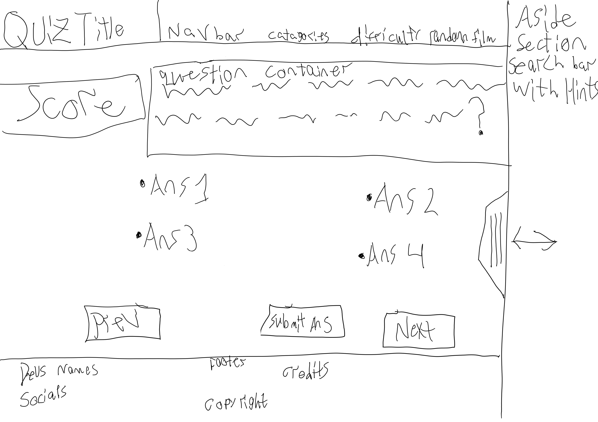
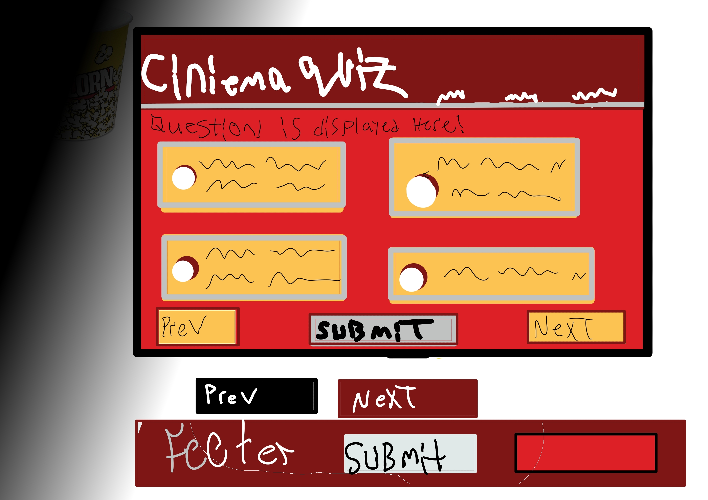

# cinema-quiz
## Description

Help people increase their movie knownledge by taking a fun quiz.

Can prepare users for movie trivia night.

Learn the process of working with others and the functionality of API's.

## Installation

N/A

## Usage
 

Go to weboage, have questions displayed, click on one of multipule choices, once clicked, shows next questions, has a hint button with an interactice search bar, get to see your score of correct answers, to take another quiz refresh page.
## Credits
[Flowbite Crash Course](https://youtu.be/KaLxCiilHns)

[Build a Quiz App](https://www.youtube.com/watch?v=3aKOQn2NPFs)

## Libraires Used

[Open Trivia Database](https://opentdb.com/)

[Flowbite](https://flowbite.com/)

[Tailwind](https://tailwindcss.com/)

[TheOpenMovieDatabase](https://www.omdbapi.com/)

## License
This uses GPL-3.0 license.
## Features

-Has interactice search bar

