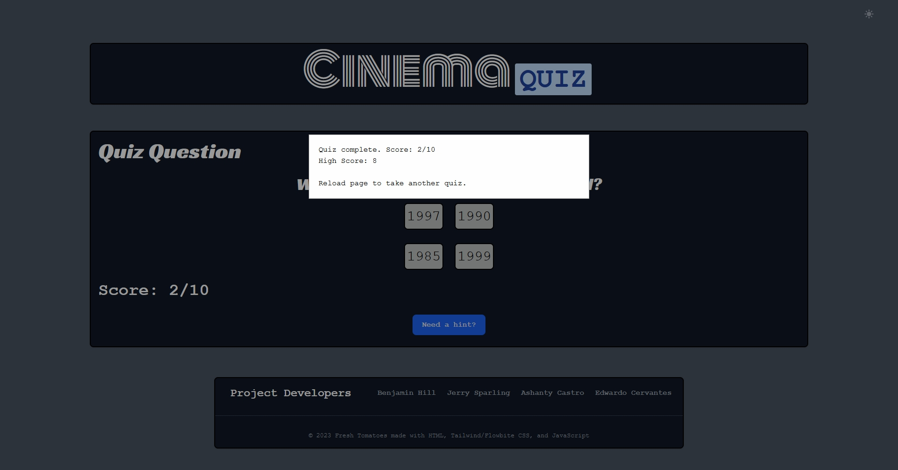

# Cinema-Quiz

## Description

This is an app to help people increase their movie knowledge by taking a fun quiz. Some uses for this app can be for people to prepare for movie trivia night with friends or to learn about other movies a user has not heard of shown in the quiz.

This project helped us learn the process of working with others by giving us our own firsthand experience collaborating on a repository. It also helped us understand the functionality of API's and their usage. One of the biggest challenges this project posed to all of us was trying to incorporate two different APIs to work together in a functioning useful app.

We all learned about a couple new frameworks named Tailwind CSS ane Flowbite which is built utilizing components from Tailwind. These featured neat tools such as for Tailwind the ease of styling HTML. And regular HTML components such as forms and buttons in Flowbite. One specific tool which helped us incredibly was the "Drawer" component from Flowbite. This was exactly the thing we needed for our idea to have an aside like panel which a user would see only when activate with a button. We will make use of this and other components in future projects and updating our previous ones.

## Installation

You can either just go to the website from the Github repository or via this [link](https://excervantes.github.io/cinema-quiz/) or clone the code from the repository.  

## Usage

To use this app go to webpage and there a user will see a random quiz relating to many well known movies throughout the years. A user will be presented with ten questions, multiple choice, and four possible answers with one correct answer. Once a user has clicked on a question the next question will appear until all ten questions for that specific quiz have been answered.

A score will appear in the quiz box to keep track of the current quiz's correct answers. Once the quiz has completed a box will appear and display the current score of correct answers out of ten along with the user's best quiz score.

If a user is stuck on a question there is a search bar via the "Need a hint?" button. A side panel will appear where a user can type out a movie title to get information about that movie as well as others.

## Credits

"Flowbite". (2022, August 24). _Flowbite Crash Course in 20 mins | Introduction to UI components using Tailwind CSS_ "Video". YouTube. https://www.youtube.com/watch?v=KaLxCiilHns

Quick, J. Q. "James Q Quick". (2019, February 16th). _Build a Quiz App (11) - Fetch API to Load Questions API_ "Video". YouTube. https://www.youtube.com/watch?v=3aKOQn2NPFs

## Libraries Used

[Open Trivia Database](https://opentdb.com/)

[TheOpenMovieDatabase](https://www.omdbapi.com/)

## APIs Used

[Tailwind CSS](https://tailwindcss.com/)

[Flowbite](https://flowbite.com/)

## License

GNU GENERAL PUBLIC LICENSE
Version 3, 29 June 2007

See LICENSE for more info

## Features

- Has a randomly generating movie quiz upon page load

- There is a movie database search accessible via a button toggle

- Features a score tracker which displays a user's highest score

